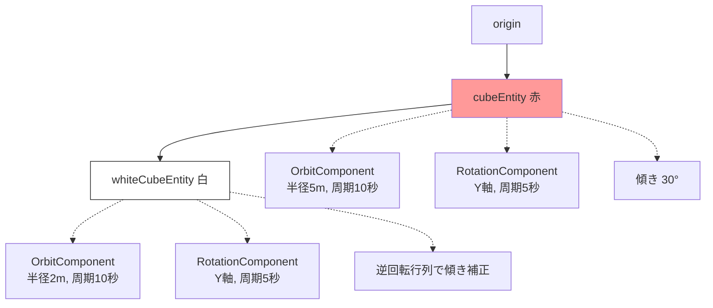
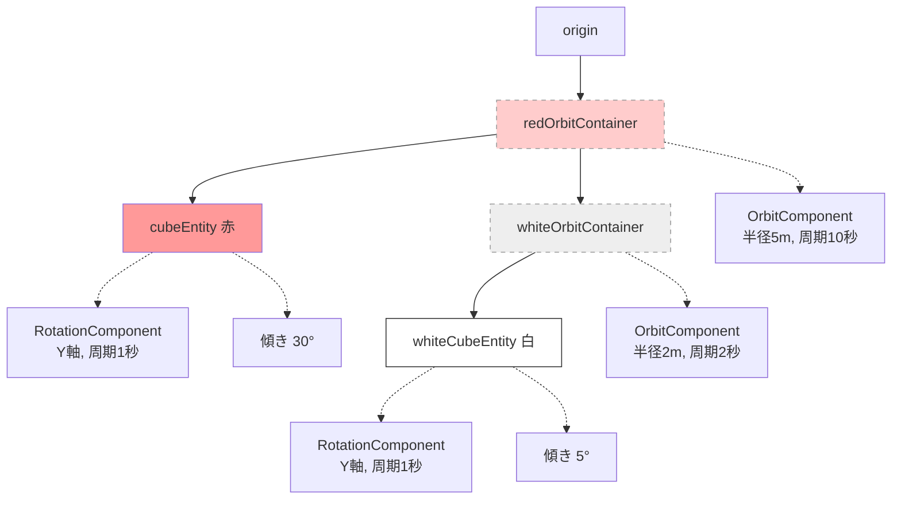

# 作業ログ: 公転と自転を分離するContainer Entity構造への変更

## プロンプト
赤いキューブが自転すると、逆回転行列も影響を受けて、結果的に白いキューブの回転軸が変化してしまう問題を解決するため、それぞれのキューブの親に公転用のContainer Entityを追加し、そのContainerにOrbitComponentを適用し、キューブ本体のEntityに自転軸の傾きやRotationComponentを適用するように変更。

## 概要
公転と自転を完全に分離するため、各キューブに公転用のContainer Entityを追加しました。これにより、親の自転が子の回転軸に影響しなくなります。

## 変更点

### 階層構造の変更

**変更前:**

**問題点:** 赤いキューブが自転すると、その回転が白いキューブの自転軸に影響を与えてしまう

**変更後:**

**解決:** 公転用Containerを追加することで、公転と自転が完全に分離される

### コードの変更内容

1. **赤いキューブのセットアップ**
   - `redOrbitContainer` Entityを作成
   - OrbitComponentをContainerに適用
   - RotationComponentと傾きはキューブ本体に適用

2. **白いキューブのセットアップ**
   - `whiteOrbitContainer` Entityを作成
   - OrbitComponentをContainerに適用
   - RotationComponentと傾きはキューブ本体に適用
   - 親の回転を相殺する逆回転行列の計算を削除（不要になった）

3. **パラメータ調整**
   - 赤いキューブの自転周期: 5秒 → 1秒
   - 白いキューブの公転周期: 10秒 → 2秒
   - 白いキューブの傾き: -30° → 5°

## 副作用
- なし（既存のOrbitSystemとRotationSystemはそのまま動作）

## 関連ファイル
- `/Users/taat/git/SolarSystemClaudeCode/SolarSystemClaudeCode/ImmersiveView.swift`

## コミット
- コミットID: 4b8c06b
- ブランチ: feature/satellite
- メッセージ: "Separate orbit and rotation using container entities"
